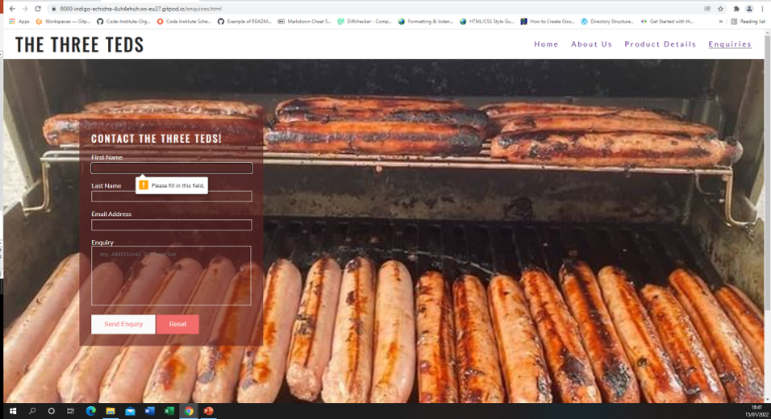
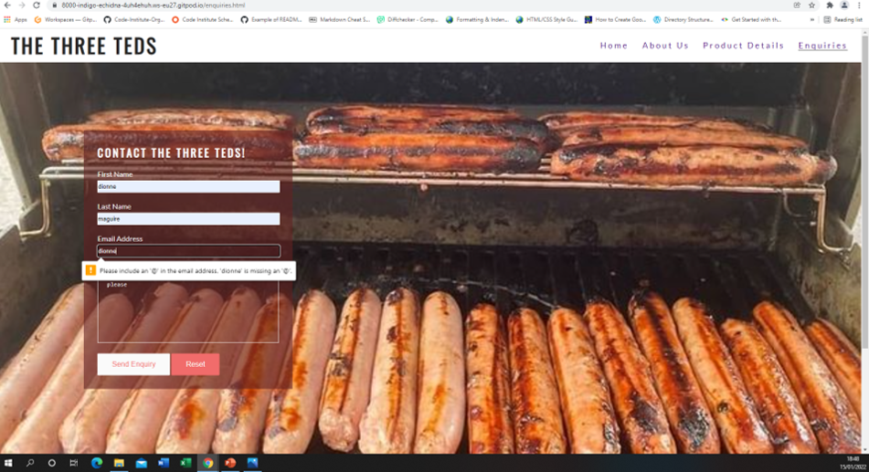
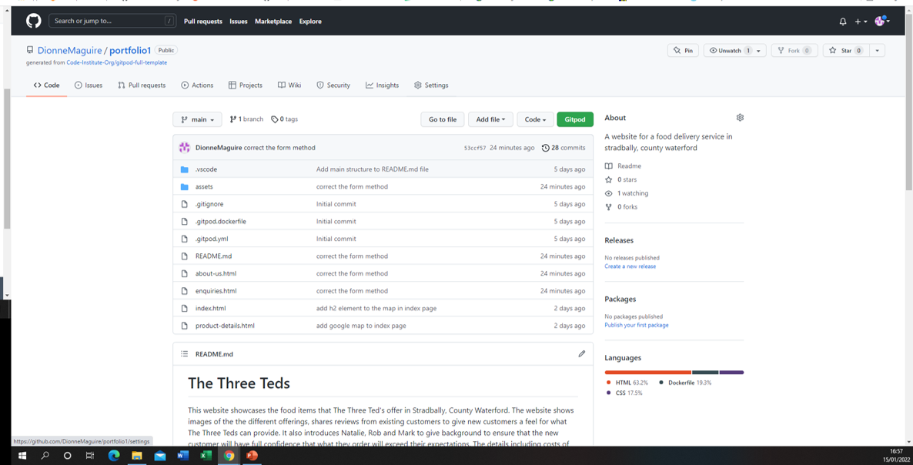
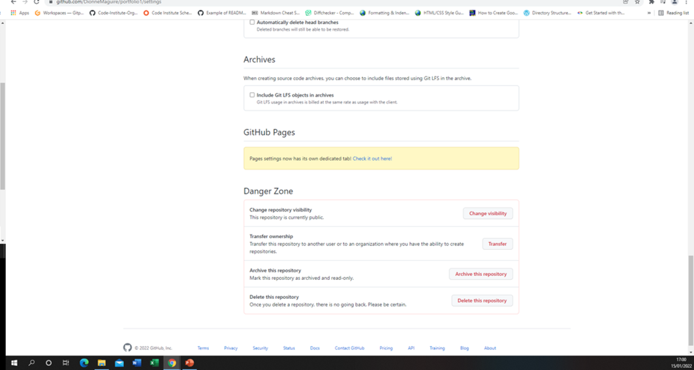
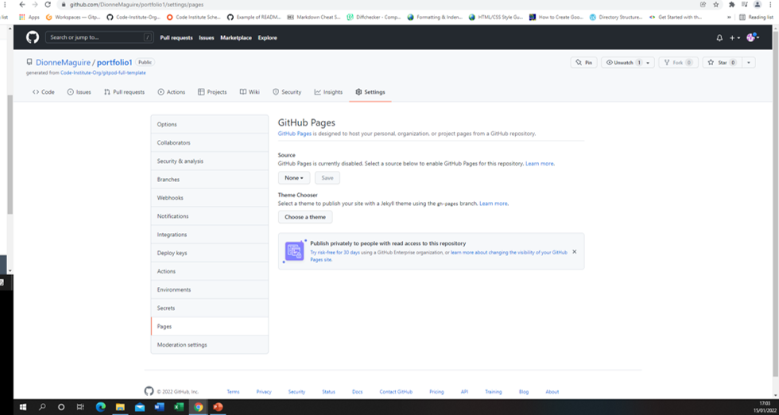
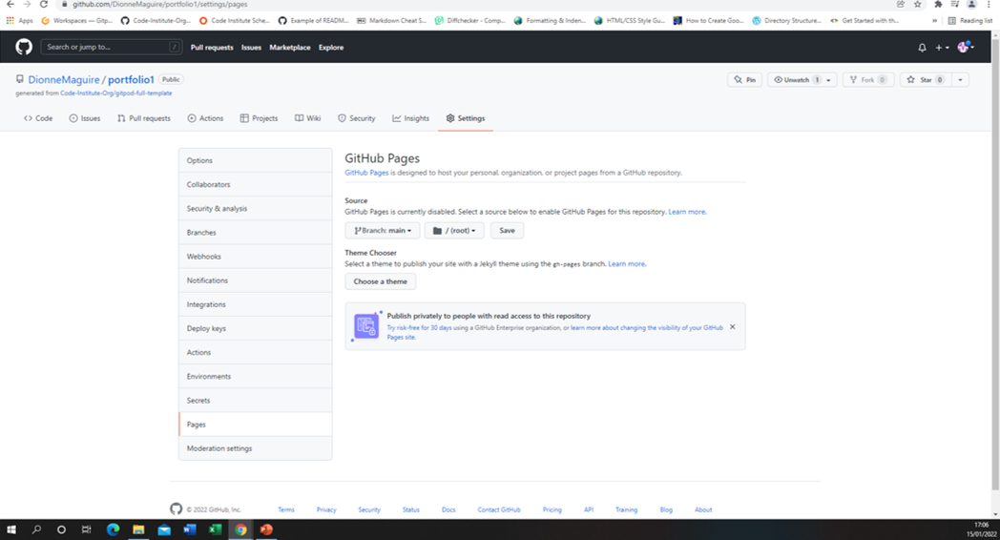
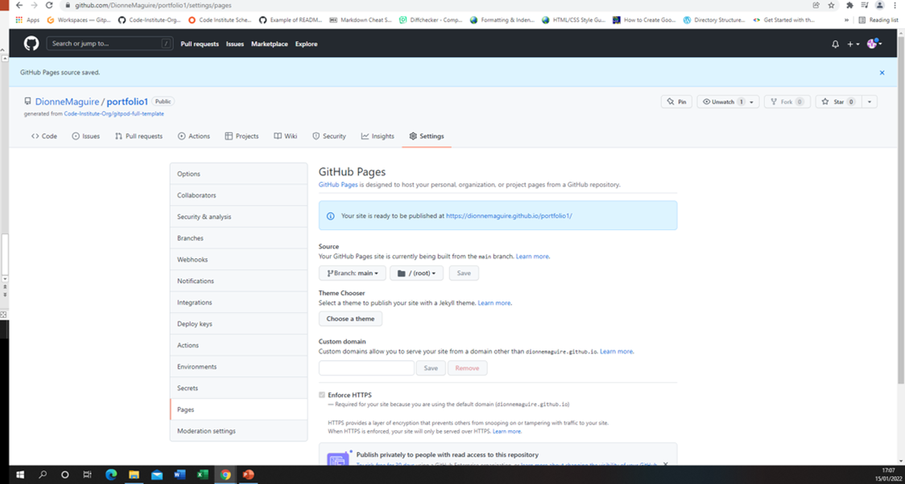

# The Three Teds

This website showcases the food items that The Three Ted's offer in Stradbally, County Waterford.  The website shows images of the the different offerings and a google map to show exactly where The Three Teds are, this is to help give new customers a feel for what The Three Teds can provide.  It also introduces Natalie, Rob and Mark to give background to ensure that the new customer will have full confidence that what they order will exceed their expectations. The details including costs of the different offerings are laid out so that the customer has all the information needed to make a decision. Finally they have an opportunity to contact The three teds for the final transaction.

## Features

### Existing features

The header and footer elements are the same in all 4 pages.
In the footer with the social media links I have set the links to open in a new tab so that the user will still have my site open. For these links I have added an aria-label for users who use screen readers.
I have set the menu link to underline when we hover over it with the cursor, to provide visual clue to the user what link they are about to click on. Also I will display a bottom border on the current page being viewed.

#### Home page
The hero image is a background image but for it to be accessible I added a aria-label with the description of the image.
Added the product images as  so that I could add alt element for screen readers.

##### Responsiveness
The title and menu still look good at 1200px breakpoint for tablets, but needs changed for 950px breakpoint for phones.

#### About us page

#### Product Details page

#### Enquiries page
In the input form I have set the send enquiry and reset buttons to change colors when the users mouse is hovering. Also the input fields borders change color when the mouse hovers over each field.
### Features left to implement
To have a reviews section to display reviews by existing customers to again build confidence in what the Three teds provide.   
To update the site to include a diary so that customers can check availability for catering or ordering opportunities.

## Testing
As I added the social media links in the footer, I checked that they opened in a new tab and also opened to the correct site.

If you try and submit an empty form you get an warning message.

If you enter an email address without a @ you get an error message.  HTML can't check if it is a valid email so I can just check if there is a @ present.

When you fill in each element on the form and submit you get the congratulations message and the data that you have sent.

### Validator testing

## Deployment
This site was deployed to GitHub pages. The steps to deploy are as follows:

1. Open repository in GitHub

2. Click settings and scroll down to GitHub pages

3. At GitHub pages

4. Here click on none and scroll down and select main

5. Click save

6. The page then displays the path that my site is published on

The live link can be found here - https://dionnemaguire.github.io/portfolio1/index.html

## Credits
I went with the same fonts as Love Running, but it is something I might revisit if I have time.
I used this video on CSS grid to help me with the product section of the home page CSS Grid Tutorial: Responsive Design Examples.
I also used information from this video on youtube https://www.youtube.com/watch?v=9zBsdzdE4sM about css grid.
I used the love running project to help with the process of setting up the Three Teds.
I used w3schools.com website to help with creating and styling the textarea.
I used https://blog.duda.co/responsive-google-maps-for-your-website to add and make my google map responsive.
