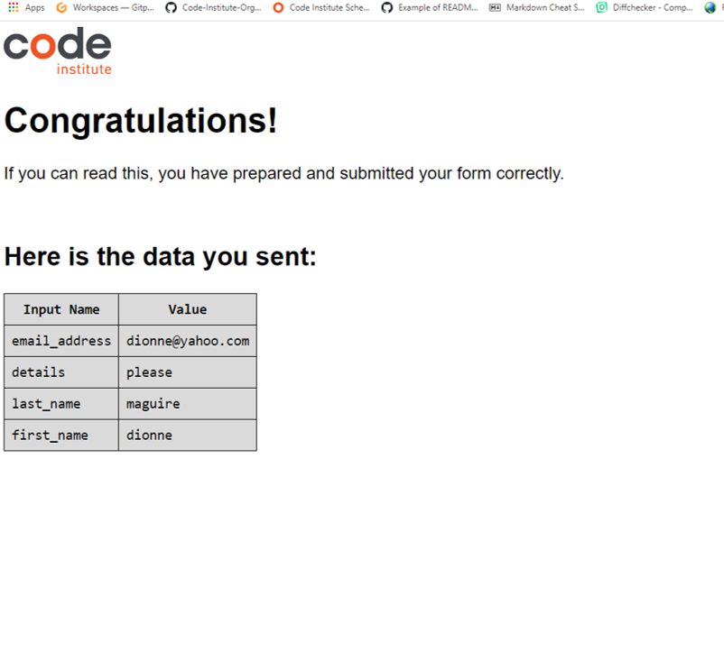

# The Three Teds

The Three Teds website showcases the food items that The Three Teds offer in Stradbally, County Waterford.  The website shows images of the different products that The Three Teds offer and a google map to show exactly where The Three Teds are located.  It introduces Natalie, Rob and Mark to give a face behind the business, to give users confidence in the quality that The Three Teds can provide. The details including costs of the different offerings are laid out so that the customer has all the information needed to make a decision. Finally they have an opportunity to contact The Three Teds for the final transaction. The site is targeted towards users in the Stradbally area interested in food and making life easier for themselves by what The Three Teds have to offer.

## Features

### Navigation
- At the top of the page, the navigation shows the company name in the left hand corner : The Three Teds
- The other navigation links are to the right : Home, About Us, Product Details and Enquiries which link to different pages. 
- I have used a dark text against a white background so that all is easy to read.
- I have set the menu link to underline when we hover over it with the cursor, to provide visual clue to the user what link they are about to click on. 
- Also I have displayed a bottom border on the current page being viewed.
- The header is the same across the four pages for consistency.

### Home page
- The landing page is an image of people having a great time with food.
- The hero image is a background image but for it to be accessible I added a aria-label with the description of the image.
- The over text on the hero image is dark text on a pale background again to make the text easily readable.

#### Product section
- The product section of the home page showcases 4 products that The Three Teds offer: 
- DIY pizza kits 
- Grazing platters 
- Sandwich packs
- Sausages and Blaas at Stradbally market.
- I added the product images as an image tag so that I could add alt element for screen readers.

##### Map section
I have inserted a google map to show customers where Stradbally is, this is clickable to open a larger map in a new tab.

##### Footer section
- The footer element is the same in all 4 pages for consistency.
- In the footer, I have set the social media links to open in a new tab so that the user will still have my site open.
- For these links I have added an aria-label for users who use screen readers.

### About us page
- This page gives a little background and introduction to how the The Three Teds came about, to give the user information and build confidence.
- It introduces the user to the Three Teds : Natalie, Rob and Mark.  
- There is a picture and a write up about each of the Three Teds.  
- The user can be confident in their hygiene and food standards with all having HACCP level 1.

### Product Details page
The product details page goes through the products mentioned on the home page but goes into more detail with prices and different options.  

### Enquiries page
- The enquiries page allows the user to contact The Three Teds with their name, email address and a text area with their query.
- The input form has been set so that the user can not enter an empty field on the form.
- In the input form I have set the send enquiry and reset buttons to change colors when the users mouse is hovering. 
- The input fields borders change color when the mouse hovers over each field.

### Future features left to implement
- To have a reviews section to display reviews by existing customers to again build confidence in what the Three teds provide.   
- To update the site to include a diary so that customers can check availability for catering or ordering opportunities.

## Testing
- I checked that the navigation links worked and took the user to the correct page on all 4 pages.
- I checked that if I hovered on the navigation link the name was underlined.
- I checked that clicking the google map worked.
- As I added the social media links in the footer, I checked that they opened in a new tab and also opened to the correct site.

- In the Enquiries page I checked:
- If you try and submit an empty form you get an warning message.

- If you enter an email address without a @ you get an error message.  HTML can't check if it is a valid email so I can just check if there is a @ present.

- When you fill in each element on the form and submit you get the congratulations message and the data that you have sent.

- I tested all the above on the development site and the fully deployed site
- I tested that my website worked on different browsers - Google chrome, Safari, Microsoft edge, Explorer, Mozilla Firefox
- I tested that my website is responsive, looks good and functions on all standard screen sizes using devtools.
- I have also manually tested on a number of different devices - android phone, ipad.

### Validator testing

- HTML - no errors returned when passing through the official W3C HTML validator
- CSS - No errors returned when passing through the W3C CSS validator
- Accessibility - I ran it through lighthouse in devtools and got the following results:

## Deployment
This site was deployed to GitHub pages. The steps to deploy are as follows:

1. Open repository in GitHub

2. Click settings and scroll down to GitHub pages

3. At GitHub pages

4. Here click on none and scroll down and select main

5. Click save

6. The page then displays the path that my site is published on

- The live link can be found here - https://dionnemaguire.github.io/portfolio1/index.html

## Credits
- I went with the same fonts as Love Running, they are clear and easy to read.
- I used this video on CSS grid to help me with the product section of the home page CSS Grid Tutorial: Responsive Design Examples.
- I also used information from this video on youtube https://www.youtube.com/watch?v=9zBsdzdE4sM about css grid.
- I used the love running project to help with the process of setting up the Three Teds.
- I used w3schools.com website to help with creating and styling the textarea.
- I used https://blog.duda.co/responsive-google-maps-for-your-website to add the google map.
- I used http://crushpixel.com for my hero image.
- I used w3schools and developer.mozilla.org to set up css cards in the about us page.
- I searched on slack for issues that I was having to see had anyone else had similar problems.
- 
